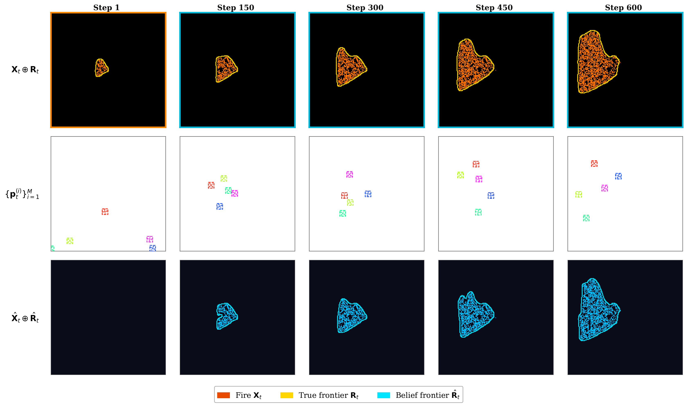
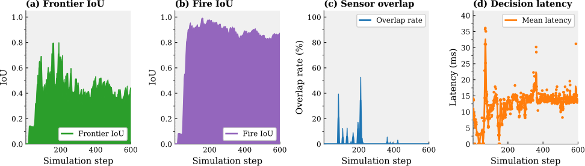

# PSO-Guidance


---

## Overview

**PSO-Guidance** is a **training-free** guidance framework for **multi-UAV wildfire frontier tracking**.

Each drone runs its own **Particle Swarm Optimization** in velocity space at every control step.


- **Partial observability**: the belief map starts empty and is built by flying
- **Decentralized**: drones share only positions and the belief map
- **Flight-validated** with 3 DJI Mini 3 quadrotors

---

## Simulation: belief vs. ground truth

<p align="center">
  
</p>

> Top: true fire and frontier. Middle: UAV positions with FoV footprints. Bottom: the shared belief map, built incrementally from observations alone — starting completely dark at `t = 0`.

---

## Performance

<p align="center">
  
</p>

✔ Evaluated with **frontier IoU**, **fire IoU**, **sensor overlap rate** and **per-drone decision latency** over 600 steps on a 200 × 200 grid.


## Structure

```
guidance_pso/
├── main.py          # closed-loop simulation
├── world.py         # parameters
├── metrics.py       # IoU, overlap, latency
├── guidance/        # guidance strategy
├── perception/      # belief map, OpenCV frontier extraction
├── firemodel/       # cellular-automata propagation
└── viz/             # animation & figures
```

---

## Installation

```bash
git clone https://github.com/drones-fireflies/pso-guidance.git
cd pso-guidance
pip install -r requirements.txt
python3 -m guidance_pso.main
```

Other entry points:

```bash
python3 -m guidance_pso.firemodel.demo_propagation   # fire propagation alone
python3 -m guidance_pso.viz.plot_case_study          # regenerate the figure above
```

---

## Citation

```bash
@inproceedings{chakraa2026pso,
  title={Decentralized PSO-Based Guidance for Multi-UAV Wildfire Monitoring and Frontier Tracking},
  author={Chakraa, Hamza and Feurgard, Ma{\"e}l and Bronz, Murat},
  booktitle={17th International Micro Air Vehicle Conference and Competition (IMAV 2026)},
  year={2026},
}
```
